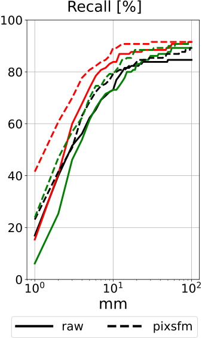

# Pixel-Perfect Structure-from-Motion

### Best student paper award @ [ICCV 2021](http://iccv2021.thecvf.com/)

We introduce a framework that **improves the accuracy of Structure-from-Motion (SfM) and visual localization** by refining keypoints, camera poses, and 3D points using the direct alignment of deep features. It is presented in our paper:
- [Pixel-Perfect Structure-from-Motion with Featuremetric Refinement](https://arxiv.org/abs/2108.08291)
- Authors: [Philipp Lindenberger](https://scholar.google.com/citations?user=FMVAi2YAAAAJ&hl=en)\*, [Paul-Edouard Sarlin](https://psarlin.com/)\*, [Viktor Larsson](http://people.inf.ethz.ch/vlarsson/), and [Marc Pollefeys](http://people.inf.ethz.ch/pomarc/)
- Website: [psarlin.com/pixsfm](https://psarlin.com/pixsfm/) (videos, slides, poster)

Here we provide `pixsfm`, a Python package that can be readily used with [COLMAP](https://colmap.github.io/) and [our toolbox hloc](https://github.com/cvg/Hierarchical-Localization/). This makes it easy to **refine an existing COLMAP model or reconstruct a new dataset with state-of-the-art image matching**. Our framework also improves visual localization in challenging conditions.

<p align="center">
  <a href="https://arxiv.org/abs/2108.08291"></a>
</p>

The refinement is composed of 2 steps:

1. **Keypoint adjustment:** before SfM, jointly refine all 2D keypoints that are matched together.
2. **Bundle adjustment:** after SfM, refine 3D points and camera poses.

In each step, we optimize the consistency of dense deep features over multiple views by minimizing a featuremetric cost. These features are extracted beforehand from the images using a pre-trained CNN.

With `pixsfm`, you can:

- reconstruct and refine a scene using hloc, from scratch or with given camera poses
- localize and refine new query images using hloc
- run the keypoint or bundle adjustments on a COLMAP database or 3D model
- evaluate the refinement with new dense or sparse features on the ETH3D dataset

 Our implementation scales to large scenes by carefully managing the memory and leveraging parallelism and SIMD vectorization when possible.

## Installation

`pixsfm` requires Python >=3.6, GCC >=4.9, and COLMAP [installed from source](https://colmap.github.io/install.html#build-from-source) at the latest commit. The core optimization is implemented in C++ with [Ceres](https://github.com/ceres-solver/ceres-solver/) but we provide Python bindings with high granularity. The code is written for UNIX and has not been tested on Windows. The remaining dependencies are listed in `requirements.txt` and include [PyTorch](https://pytorch.org/) >=1.7 and [pycolmap](https://github.com/colmap/pycolmap) built from source:

```bash
# install COLMAP following colmap.github.io/install.html#build-from-source
sudo apt-get install libhdf5-dev
git clone https://github.com/cvg/pixel-perfect-sfm --recursive
cd pixel-perfect-sfm
pip install -r requirements.txt
```

To use other local features besides SIFT via COLMAP, we also require [hloc](https://github.com/cvg/Hierarchical-Localization/):
```bash
git clone --recursive https://github.com/cvg/Hierarchical-Localization/
cd Hierarchical-Localization/
pip install -e .
```

Finally build and install the `pixsfm` package:
```bash
pip install -e .  # install pixsfm in develop mode
```

We highly recommend to use `pixsfm` with a working GPU for the dense feature extraction. All other steps can only run on the CPU. Having issues with compilation errors or runtime crashes? Want to use the codebase as a C++ library? Check our [FAQ](./doc/FAQ.md).

## Tutorial

The Jupyter notebook [`demo.ipynb`](./demo.ipynb) demonstrates a minimal usage example. It shows how to run Structure-from-Motion and the refinement, how to align and compare different 3D models, and how to localize and refine additional query images.

<p align="center">
  <a href="./notebooks/demo.ipynb"></a>
  <br /><em>Visualizing mapping and localization results in the demo.</em>
</p>

## Structure-from-Motion

### End-to-end SfM with hloc

Given keypoints and matches computed with hloc and stored in HDF5 files, we can run Pixel-Perfect SfM from a Python script:

```python
from pixsfm.refine_hloc import PixSfM
refiner = PixSfM()
model, debug_outputs = refiner.reconstruction(
    path_to_working_directory,
    path_to_image_dir,
    path_to_list_of_image_pairs,
    path_to_keypoints.h5,
    path_to_matches.h5,
)
# model is a pycolmap.Reconstruction 3D model
```

or from the command line:

```bash
python -m pixsfm.refine_hloc reconstructor \
    --sfm_dir path_to_working_directory \
    --image_dir path_to_image_dir \
    --pairs_path path_to_list_of_image_pairs \
    --features_path path_to_keypoints.h5 \
    --matches_path path_to_matches.h5
```

Note that:

- The final refined 3D model is written to `path_to_working_directory` in either case.
- Dense features are automatically extracted (on GPU when available) using a pre-trained CNN, [S2DNet](https://github.com/germain-hug/S2DNet-Minimal) by default.
- The result `debug_outputs` contains the dense features and optimization statistics.

### Configurations

We have fine-grained control over all hyperparameters via [OmegaConf](https://omegaconf.readthedocs.io/) configurations, which have sensible default values defined in `PixSfM.default_conf`. See [Detailed configuration](#detailed-configuration) for a description of the main configuration entries and their defaults.

<details>
<summary>[Click to see some examples]</summary>

For example, dense features are stored in memory by default. If we reconstruct a large scene or have limited RAM, we should instead write them to a cache file that is loaded on-demand. With the Python API, we can pass a configuration update:
```python
refiner = PixSfM(conf={"dense_features": {"use_cache": True}})
```
or equivalently with the command line [using a dotlist](https://omegaconf.readthedocs.io/en/2.1_branch/usage.html#from-command-line-arguments):

```bash
python -m pixsfm.refine_hloc reconstructor [...] dense_features.use_cache=true
```

We also provide ready-to-use configuration templates in [`pixsfm/configs/`](./pixsfm/configs/) covering the main use cases. For example, [`pixsfm/configs/low_memory.yaml`](./pixsfm/configs/low_memory.yaml) reduces the memory consumption to scale to large scene and can be used as follow:
```python
refiner = PixSfM(conf="low_memory")
# or
python -m pixsfm.refine_hloc reconstructor [...] --config low_memory
```

</details>

### Triangulation from known camera poses

<details>
<summary>[Click to expand]</summary>

If camera poses are available, we can simply triangulate a 3D point cloud from an existing reference COLMAP model with:

```python
model, _ = refiner.triangulation(..., path_to_reference_model, ...)
```
or
```bash
python -m pixsfm.refine_hloc triangulator [...] \
    --reference_sfm_model path_to_reference_model
```

By default, camera poses and intrinsics are optimized by the bundle adjustment. To keep them fixed, we can simply overwrite the corresponding options as:
```python
conf = {"BA": {"optimizer": {
    "refine_focal_length": False,
    "refine_extra_params": False,  # distortion parameters
    "refine_extrinsics": False,    # camera poses
}}}
refiner = PixSfM(conf=conf)
refiner.triangulation(...)
```
or equivalently
```bash
python -m pixsfm.refine_hloc triangulator [...] \
  'BA.optimizer={refine_focal_length: false, refine_extra_params: false, refine_extrinsics: false}'
```

</details>

### Keypoint adjustment

The first step of the refinement is the keypoint adjustment (KA). It refines the keypoints from tentative matches only, before SfM. Here we show how to run this step separately.

<details>
<summary>[Click to expand]</summary>

To refine keypoints stored in an hloc HDF5 feature file:
```python
from pixsfm.refine_hloc import PixSfM
refiner = PixSfM()
keypoints, _, _ = refiner.refine_keypoints(
    path_to_output_keypoints.h5,
    path_to_input_keypoints.h5,
    path_to_list_of_image_pairs,
    path_to_matches.h5,
    path_to_image_dir,
)
```

To refine keypoints stored in a COLMAP database:
```python
from pixsfm.refine_colmap import PixSfM
refiner = PixSfM()
keypoints, _, _ = refiner.refine_keypoints_from_db(
    path_to_output_database,  # pass path_to_input_database for in-place refinement
    path_to_input_database,
    path_to_image_dir,
)
```

In either case, there is an equivalent command line interface.

</details>

### Bundle adjustment

The second contribution of the refinement is the bundle adjustment (BA). Here we show how to run it separately to refine an existing COLMAP 3D model.

<details>
<summary>[Click to expand]</summary>

To refine a 3D model stored on file:
```python
from pixsfm.refine_colmap import PixSfM
refiner = PixSfM()
model, _, _, = refiner.refine_reconstruction(
    path_to_input_model,
    path_to_output_model,
    path_to_image_dir,
)
```

Using the command line interface:
```bash
python -m pixsfm.refine_colmap bundle_adjuster \
    --input_path path_to_input_model \
    --output_path path_to_output_model \
    --image_dir path_to_image_dir
```

</details>

## Visual localization

When estimating the camera pose of a single image, we can also run the keypoint and bundle adjustments before and after PnP+RANSAC. This requires reference features attached to each observation of the reference model. They can be computed in several ways.

<details>
<summary>[Click to learn how to localize a single image]</summary>

1. To recompute the references from scratch, pass the path to the reference images:

```python
from pixsfm.localization import QueryLocalizer
localizer = QueryLocalizer(
    reference_model,  # pycolmap.Reconstruction 3D model
    image_dir=path_to_reference_image_dir,
    dense_features=cache_path,  # optional: cache to file for later reuse
)
pose_dict = localizer.localize(
    pnp_points2D      # keypoints with valid 3D correspondence (N, 2)
    pnp_point3D_ids,  # IDs of corresponding 3D points in the reconstruction
    query_camera,     # pycolmap.Camera
    image_path=path_to_query_image,
)
if pose_dict["success"]:
    # quaternion and translation of the query, from world to camera
    qvec, tvec = pose_dict["qvec"], pose_dict["tvec"]
```

The default localization configuration can be accessed with `QueryLocalizer.default_conf`.

2. Alternatively, if dense reference features have already been computed during the pixel-perfect SfM, it is more efficient to reuse them:

```python
refiner = PixSfM()
model, outputs = refiner.reconstruction(...)
features = outputs["feature_manager"]
# or load the features manually
features = pixsfm.extract.load_features_from_cache(
    refiner.resolve_cache_path(output_dir=path_to_output_sfm)
)
localizer = QueryLocalizer(
    reference_model,  # pycolmap.Reconstruction 3D model
    dense_features=features,
)
```

</details>

We can also batch-localize multiple queries equivalently to [`hloc.localize_sfm`](https://github.com/cvg/Hierarchical-Localization/blob/master/hloc/localize_sfm.py):

```python
pixsfm.localize.main(
    dense_features,  # FeatureManager or path to cache file
    reference_model,  # pycolmap.Reconstruction 3D model
    path_to_query_list,
    path_to_image_dir,
    path_to_image_pairs,
    path_to_keypoints,
    path_to_matches,
    path_to_output_results,
    config=config,  # optional dict
)
```

## Example: mapping and localization

We now show how to run the featuremetric pipeline on the Aachen Day-Night v1.1 dataset. First, download the dataset by following [the instructions described here](https://github.com/cvg/Hierarchical-Localization/tree/master/hloc/pipelines/Aachen_v1_1#installation). Then run `python examples/sfm+loc_aachen.py`, which will perform mapping and localization with SuperPoint+SuperGlue. As the scene is large, with over 7k images, we cache the dense feature patches and therefore require about 350GB of free disk space. Expect the sparse feature matching to take a few hours on a recent GPU. We also show in [`examples/refine_sift_aachen.py`](examples/refine_sift_aachen.py) how to start from an existing COLMAP database.

## Evaluation

We can evaluate the accuracy of the pixel-perfect SfM and of camera pose estimation on the ETH3D dataset. Refer to the paper for more details.

First, we download the dataset with `python -m pixsfm.eval.eth3d.download`, by default to `./datasets/ETH3D/`.

### 3D triangulation

<details>
<summary>[Click to expand]</summary>

We first need to install the [ETH3D multi-view evaluation tool](https://github.com/ETH3D/multi-view-evaluation):

```bash
sudo apt install libpcl-dev  # linux only
git clone git@github.com:ETH3D/multi-view-evaluation.git
cd multi-view-evaluation && mkdir build && cd build
cmake .. && make -j
```

We can then evaluate the accuracy of the sparse 3D point cloud triangulated with Pixel-Perfect SfM, for example on the courtyard scene with SuperPoint keypoints:

```bash
python -m pixsfm.eval.eth3d.triangulation \
    --scenes courtyard \
    --methods superpoint \
    --tag pixsfm
```

- omit `--scenes` and `--methods` to run all scenes with all feature detectors.
- the results are written to `./outputs/ETH3D/` by default
- use `--tag some_run_name` to distinguish different runs
- add `--config norefine` to turn off any refinement or use the dotlist `KA.apply=false BA.apply=false` 
- add `--config photometric` to run the photometric BA (no KA)

To aggregate the results and compare different runs, for example with and without refinement, we run:

```bash
python -m pixsfm.eval.eth3d.plot_triangulation \
    --scenes courtyard \
    --methods superpoint \
    --tags pixsfm raw
```

Running on all scenes and all detectors should yield the following results (±1%):

```
----scene---- -keypoints- -tag-- -accuracy @ X cm- completeness @ X cm
                                  1.0   2.0   5.0   1.0   2.0   5.0 
----------------------------------------------------------------------
indoor        sift        raw    75.95 85.50 92.88  0.21  0.88  3.65
                          pixsfm 83.16 89.94 94.94  0.25  0.96  3.77
              superpoint  raw    78.96 87.77 94.55  0.64  2.36  9.39
                          pixsfm 89.93 94.09 97.04  0.76  2.62  9.85
              r2d2        raw    67.91 80.25 90.45  0.55  2.12  8.85
                          pixsfm 81.09 87.78 93.41  0.67  2.32  9.04
----------------------------------------------------------------------
outdoor       sift        raw    57.70 72.90 86.41  0.06  0.34  2.46
                          pixsfm 68.10 80.57 91.59  0.08  0.42  2.75
              superpoint  raw    53.63 68.93 83.27  0.11  0.64  4.43
                          pixsfm 71.83 82.65 92.06  0.18  0.89  5.40
              r2d2        raw    49.33 66.21 83.37  0.11  0.55  3.62
                          pixsfm 67.94 81.02 91.68  0.16  0.71  3.99
```

The results of this evaluation can be different from the numbers reported in the paper. The trends are however similar and the conclusions of the paper still hold. This difference is due to improvements of the `pixsfm` code and to changes in the SuperPoint implementation: we initially used the setup of [PatchFlow](https://github.com/mihaidusmanu/local-feature-refinement) and later switched to hloc, which is strictly better and easier to install.

</details>

### Camera pose estimation

<details>
<summary>[Click to expand]</summary>

Similarly, we evaluate the accuracy of camera pose estimation given sparse 3D models triangulated from other views:
```bash
python -m pixsfm.eval.eth3d.localization --tag pixsfm
```

Again, we can also run on a subset of scenes or keypoint detectors. To aggregate the results and compare different runs, for example with and without KA and BA, we run:

```bash
python -m pixsfm.eval.eth3d.plot_localization --tags pixsfm raw
```

We should then obtain the following table and plot (±2%):

<table><tr><td>

```
-keypoints- -tag-- -AUC @ X cm (%)--
                    0.1    1    10  
sift        raw    16.92 55.39 81.15
            pixsfm 23.08 60.47 84.01
superpoint  raw    15.38 63.41 87.24
            pixsfm 41.54 73.86 89.66
r2d2        raw     6.15 51.70 83.46
            pixsfm 23.85 62.41 86.89
```

</td><td>

<p align="center">
  </a>
</p>

SIFT (black), SuperPoint (red), R2D2 (green)

</td></tr></table>

Results for the 0.1cm threshold can vary across setups and therefore differ from the numbers reported in the paper. This might be due to changes in the PyTorch and COLMAP dependencies. We are investigating this but any help is welcome!

</details>

## Advanced usage

### Detailed configuration

Here we explain the main configuration entries for mapping and localization along with their default values:

<details>
<summary>[Click to expand]</summary>

```yaml
dense_features:  # refinement features
  model:  # the CNN that extracts the features
    name: s2dnet  # the name of one of the models defined in pixsfm/features/models/
    num_layers: 1  # the number of output layers (model-specific parameters)
  device: auto  # cpu, cuda, or auto-determined based on CUDA availability
  max_edge: 1600  # downscale the image such the largest dimension has this value
  resize: LANCZOS  # interpolation algorithm for the image resizing
  pyr_scales: [1.0]   # concat features extracted at multiple scales
  fast_image_load: false  # approximate resizing for large images
  l2_normalize: true  # whether to normalize the features so they have unit norm
  sparse: true  # whether to store sparse patches of features instead of the full feature maps
  patch_size: 8  # the size of the feature patches if sparse
  dtype: half  # the data type of features when stored, half float or double
  use_cache: false  # whether to cache the features on file or keep them in memory
  overwrite_cache: false  # whether to overwrite the cache file if it already exists
  cache_format: chunked
interpolation:
  nodes: [[0.0, 0.0]]  # grid over which to compute the cost, by default a single point
  mode: BICUBIC  # the interpolation algorithm
  l2_normalize: true
  ncc_normalize: false  # only works if len(nodes)>1, mostly for photometric
mapping:  # pixsfm.refine_colmap.PixSfM
  dense_features: ${..dense_features}
  KA:  # keypoint adjustment
    apply: true  # whether to apply or instead skip
    strategy: featuremetric  # regular, or alternatively topological_reference (much faster)
    interpolation: ${...interpolation}  # we can use a different interpolation for KA
    level_indices: null  # we can optimize a subset of levels, by default all
    split_in_subproblems: true  # parallelize the optimization
    max_kps_per_problem: 50  # parallelization, a lower value saves memory, conservative if -1
    optimizer:  # optimization problem and solving
      loss:
        name: cauchy  # name of the loss function, among {huber, soft_l1, ...}
        params: [0.25]  # loss-specific parameters
      solver:
        function_tolerance: 0.0
        gradient_tolerance: 0.0
        parameter_tolerance: 1.0e-05
        minimizer_progress_to_stdout: false  # print a progress bar
        max_num_iterations: 100  # maximum number of optimization iterations
        max_linear_solver_iterations: 200
        max_num_consecutive_invalid_steps: 10
        max_consecutive_nonmonotonic_steps: 10
        use_inner_iterations: false
        use_nonmonotonic_steps: false
        num_threads: 1
      root_regularize_weight: -1  # prevent drift by adding edges to the root node, disabled if -1
      print_summary: false  # whether to print a detailed summary after completion
      bound: 4.0  # constraint on the distance (in pixels) w.r.t. the initial values
      num_threads: -1  # number of threads if parallelize in subproblems
  BA:  # bundle adjustment
    apply: true  # whether to apply or instead skip
    strategy: feature_reference  # regular, or alternatively {costmaps, patch_warp}
    interpolation: ${...interpolation}  # we can use a different interpolation for BA
    level_indices: null  # we can optimize a subset of levels, by default all
    max_tracks_per_problem: 10  # parallelization of references/costmaps, a lower value saves memory
    num_threads: -1
    optimizer:
      loss:  # same config as KA.optimizer.loss
      solver:  # same config as KA.optimizer.solver
      print_summary: false
      refine_focal_length: true  # whether to optimize the focal length
      refine_principal_point: false  # whether to optimize the principal points
      refine_extra_params: true  # whether to optimize distortion parameters
      refine_extrinsics: true  # whether to optimize the camera poses
    references:  # if strategy==feature_reference
      loss:  # what to minimize to compute the robust mean
        name: cauchy
        params: [0.25]
      iters: 100  # number of iterations to compute the robust mean
      num_threads: -1
    repeats: 1
localization:  # pixsfm.localization.main.QueryLocalizer
  dense_features: ${..dense_features}
  target_reference: nearest  # how to select references, in {nearest, robust_mean, all_observations}
  overwrite_features_sparse: null  # overwrite dense_features.sparse in query localization only
  references:  # how to compute references
    loss:  # what to minimize to compute the robust mean, same as BA.references.loss
    iters: 100
    keep_observations: true  # required for target_reference in {nearest, all_observations}
    num_threads: -1
  max_tracks_per_problem: 50  # parallelization of references, a lower value saves memory
  unique_inliers: min_error  # how we select unique matches for each 3D point
  QKA:  # query keypoint adjustment
    apply: true  # whether to apply or instead skip
    interpolation: ${...interpolation}
    level_indices: null
    feature_inlier_thresh: -1  # discard points with high feature error, disabled if -1
    stack_correspondences: False # Stack references for equal keypoints
    optimizer:
      loss:  # same config as KA.optimizer.loss
        name: trivial  # L2, no robust loss function
        params: []
      solver:  # same config as KA.optimizer.solver
      print_summary: false
      bound: 4.0  # constraint on the distance (in pixels) w.r.t. the initial values
  PnP:
    estimation:  # pycolmap.absolute_pose_estimation
      ransac:
        max_error: 12  # inlier threshold in pixel reprojection error
        estimate_focal_length: false  # if the focal length is unknown
    refinement:  # refinement in pycolmap.absolute_pose_estimation
    	refine_focal_length: false
    	refine_extra_params: false
  QBA:  # query bundle adjuster
    apply: true  # whether to apply or instead skip
    interpolation: ${...interpolation}
    level_indices: null
    optimizer:
      loss:  # same config as KA.optimizer.loss
      solver:  # same config as KA.optimizer.solver
      print_summary: false
      refine_focal_length: false
      refine_principal_point: false
      refine_extra_params: false
```

Note that the config supports [variable interpolation](https://omegaconf.readthedocs.io/en/2.0_branch/usage.html#variable-interpolation) through omegaconf.

</details>

### Large-scale refinement

When dealing with large scenes or with a large number of images, memory is often a bottleneck. The configuration [`low_memory`](./pixsfm/configs/low_memory.yaml) shows how to decrease the memory consumption by trading-off accuracy and speed.

<details>
<summary>[Click to expand]</summary>

The main improvements are:
- `dense_features`
  - store as sparse patches: `sparse=true`
  - reduce the size of the patches: `patch_size=8` (or smaller)
  - store in a cache file: `use_cache=true`
- `KA`
  - chunk the optimization, loading only a subset of features at once: `split_in_subproblems=true`
  - optimize at most around 50 keypoints per chunk: `max_kps_per_problem=50`
- `BA`
  - use the costmap approximation: `strategy=costmaps` (described in Section C of the paper)

</details>

When runtime is a limitation, one can also reduce the runtime of KA by optimizing only costs with respect to the topological center of each track with `KA.strategy=topological_reference`.

### Keypoints with large noise

<details>
<summary>[Click to expand]</summary>

Some keypoint detectors with low output resolution, like D2-Net, predict keypoints that are localized inaccurately. In this case, the refinement is highly beneficial but the default parameters are not optimal. It is necessary to increase the patch size and use multiple feature layers. An example configuration is given in [`pixsfm_eth3d_d2net`](./pixsfm/configs/pixsfm_eth3d_d2net.yaml) to evaluate D2-Net on ETH3D.

</details>

### Extending pixsfm

- To refine your own sparse keypoints or matcher, refer to [Using your own local features or matcher](https://github.com/cvg/Hierarchical-Localization/#using-your-own-local-features-or-matcher) in hloc.
- To add different dense features, see [Using your own dense features](./doc/features.md#using-your-own-features).
- For a description of how dense features are accessed and stored, see [doc/features.md](./doc/features.md).
- For a description of the internals of `pixsfm`, see [Design Principles](./doc/general.md).

Still having questions about `pixsfm`? Anything in the doc is unclear? Are you unsure whether it fits your use case? Please let us know by opening an issue!

## Contributing

We welcome external contributions, especially to improve the following points:

- [ ] make `pixsfm` work on Windows
- [ ] train and integrate dense features that are more compact with fewer dimensions
- [ ] build a conda package for pixsfm and pycolmap to not require installing COLMAP from source
- [ ] add examples on how to build featuremetric problems with pyceres

## BibTex citation

Please consider citing our work if you use any code from this repo or ideas presented in the paper:

```
@inproceedings{lindenberger2021pixsfm,
  author    = {Philipp Lindenberger and
               Paul-Edouard Sarlin and
               Viktor Larsson and
               Marc Pollefeys},
  title     = {{Pixel-Perfect Structure-from-Motion with Featuremetric Refinement}},
  booktitle = {ICCV},
  year      = {2021},
}
```
